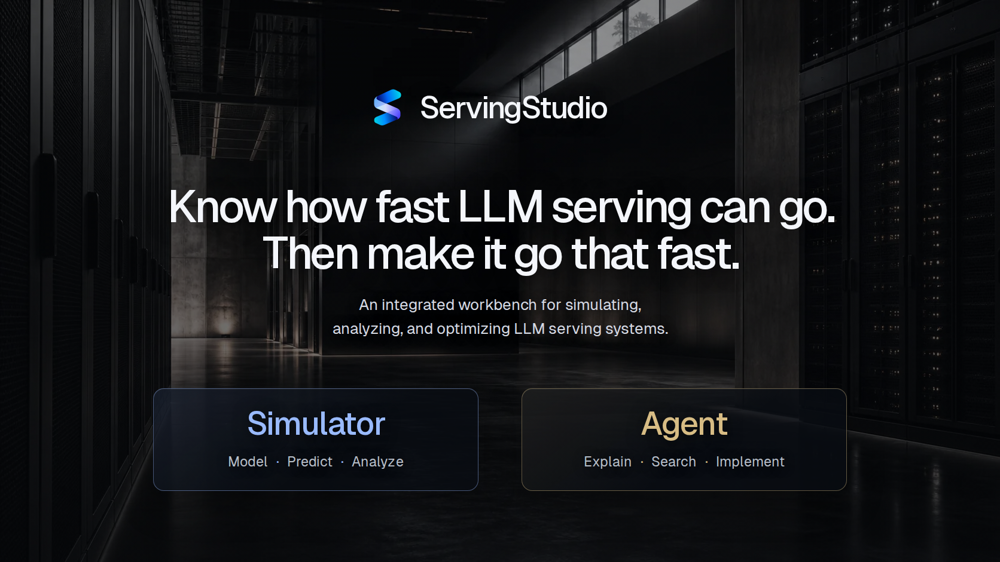

# ServingStudio: Simulate, Analyze, and Optimize LLM Serving

🔥 Optimizing LLM serving takes repeated experiments, and running them on real hardware is slow and costly.

Performance depends on how models, kernels, hardware, and serving policies interact. As models and workloads change, engineers must revisit their configuration choices.

🚀 Introducing ServingStudio: an integrated workbench for simulating, analyzing, and optimizing LLM serving systems.

🧵 More in the thread below.

(1/9)

## Why combine simulation and an Agent?

🔬 **Simulation**

✅ Reusing profiling data makes configuration exploration faster and cheaper.

⚠️ Extending a simulator to new models and interpreting its results still require considerable human efforts.

🤖 **Agents**

✅ Agents can automate profiling and implement changes in serving frameworks.

⚠️ Without full-stack performance modeling, they have limited guidance for choosing which changes to test, while hardware experiments remain slow and costly.

ServingStudio connects the two: simulation guides the Agent’s experiments, while the Agent extends the Simulator, interprets results, and implements promising changes.

(2/9)

## The Simulator

🧩 **Flexible configurations:** The Simulator supports model families including GLM-5.2 with different quantization and parallelism configurations. It also models prefix caching, speculative decoding, prefill-decode disaggregation, and attention-FFN disaggregation.

⚡ **Fast simulation:** The Simulator ran up to **2,770× faster than real time** in our evaluation.

🎯 **Accurate predictions:** Predictions are built from measured GPU kernel timings. These predictions are calibrated and validated against SGLang and vLLM measurements.

🔍 **Full observability:** You can inspect the entire run, individual requests, scheduler iterations, and kernel execution.

💡 **Optimization insights:** The analysis breaks down simulated execution time into necessary model computation and overhead from inefficient kernels, redundant operations, load imbalance, inefficient batching, communication, and idle time.

(3/9)

## The Agent

🛠️ We provide a library of Agent skills covering:

- Kernel discovery and profiling.
- Simulator development.
- Alignment with real serving frameworks.
- Experiment design.
- Performance analysis.
- Serving-system optimization.

👥 Choose how the work is organized:

- **Single-Agent:** One Agent plans and implements the work in one session.
- **Orchestrator–Implementer:** One Agent plans and reviews the work, while another implements it.

Let the Agent work autonomously while you monitor progress. Contribute workload knowledge, clarify constraints, or redirect the investigation when useful.

(4/9)

## From real measurements to real improvements

ServingStudio provides an end-to-end workflow for optimizing LLM serving.

1. 📐 **Understand the workload:** Define the model, request mix, hardware, parallelism, and performance goal, then measure a baseline.

2. 🔬 **Explore in simulation:** Extend the Simulator as needed and align baseline predictions with real measurements. Model and evaluate candidate changes to select a promising improvement.

3. 🛠️ **Build with the Agent:** Implement the selected change in a real serving framework with the Agent.

4. ⏱️ **Profile the change:** Capture a GPU trace to inspect kernel timings, communication, and idle gaps.

5. 🔍 **Align with simulation:** Compare the Simulator’s predicted performance with measurements from the modified framework. Investigate discrepancies in kernel timings, batching, communication, and host overhead.

6. ✅ **Validate on real hardware:** Check correctness and benchmark against the baseline to determine whether the change improves performance or needs another iteration.

(5/9)

## Performance Gains in Practice

📈 **SGLang GLM-5.2: 5.6% higher input throughput**

SGLang’s prefill MoE kernels ran slower than the Simulator predicted. Autotuning did not cover the prefill CUDA graph path which uses these kernels. Adding a tuning pass for that path increased input throughput by 5.6% over unmodified SGLang on our prefill-heavy benchmark.

⚙️ **vLLM GLM-5.2 MTP: 10.8% higher output throughput**

During alignment with five MTP draft tokens, we found that vLLM restricted CUDA graph sizes to multiples of six: one token plus five draft tokens per verification step. This excluded 2,048-token prefill batches from graph replay. Raising both the scheduler budget and graph limit to 2,052 restored replay. The updated configuration achieved 10.8% higher output throughput than the original configuration.

🏗️ **Mini-SGLang Qwen3-235B: 25.6% higher output throughput than vLLM**

We used the Agent to build an FP8 implementation of Qwen3-235B in Mini-SGLang. Guided by simulation and kernel analysis, the Agent simplified execution and fused kernels. The implementation delivered 25.6% higher output throughput than vLLM on our prefill-heavy benchmark.

(6/9)

## How ServingStudio Can Be Used

- 🎓 **Students** can use existing profiling data to explore how model and parallelism choices affect latency and throughput without a multi-GPU setup.
- 🔬 **Researchers** can ask the Agent to compare serving configurations for their workloads without writing simulation or profiling code.
- 🛠️ **Serving experts** can use ServingStudio to automate repetitive profiling and cost attribution, focusing their expertise on diagnosing bottlenecks and designing optimizations.
- 🖥️ **Hardware teams** can use performance predictions to guide hardware selection and new hardware design.
- 🧩 **Model architects** can estimate how attention, expert routing, precision, and decoding choices affect serving performance as they develop new architectures.

(7/9)

## What Comes Next

🔭 We plan to:

- **Support newer models**, including GLM-5.3 Flash, DeepSeek-V4, and Kimi K3.
- **Model distributed prefix caches**, including cache offloading across GPU memory, host memory, and remote storage.
- **Enable remote hardware profiling** and release a public kernel-performance database.

(8/9)

## Conclusion

ServingStudio Sim helps engineers explore optimization ideas faster in simulation. ServingStudio Agent then implements promising changes and validates their effects on real hardware.

🤝 Explore ServingStudio and try it with your workload.

🌐 [Website and case studies](https://syfi-servingstudio.github.io/ServingStudioIntro/)

🛠️ [Code and getting started](https://github.com/SyFI-ServingStudio/ServingStudio)

(9/9)
